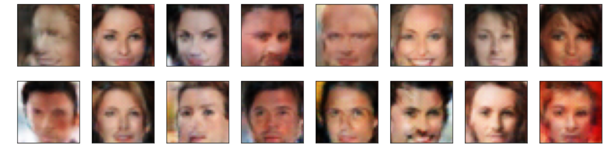

# face-generation
Face Generator Project is a part of Udacity Deep Learning Nanodegree.

## Goal
Create a Generative Adversarial Networks (GANs) network to generate *new* images of faces that look as realistic as possible!

### Dataset
The images for this project were taken from the [CelebFaces Attributes Dataset (CelebA)](http://mmlab.ie.cuhk.edu.hk/projects/CelebA.html)

##Solution
The code for this solution can be found [here](https://haruiz.github.io/face-generation)

### Some images generated by the model

